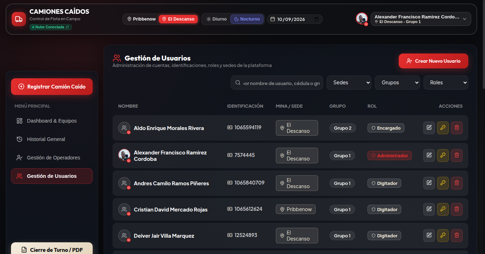
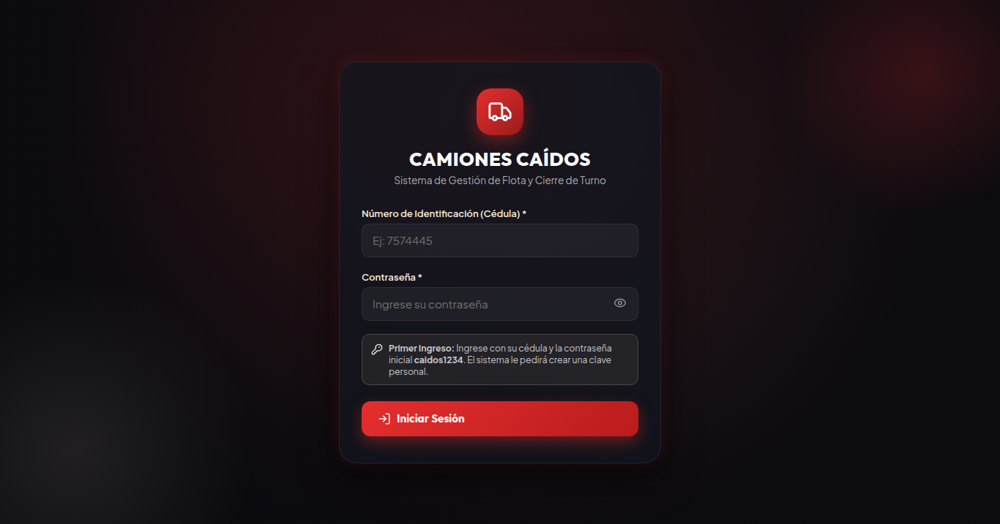
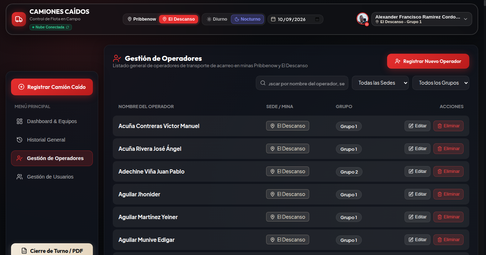
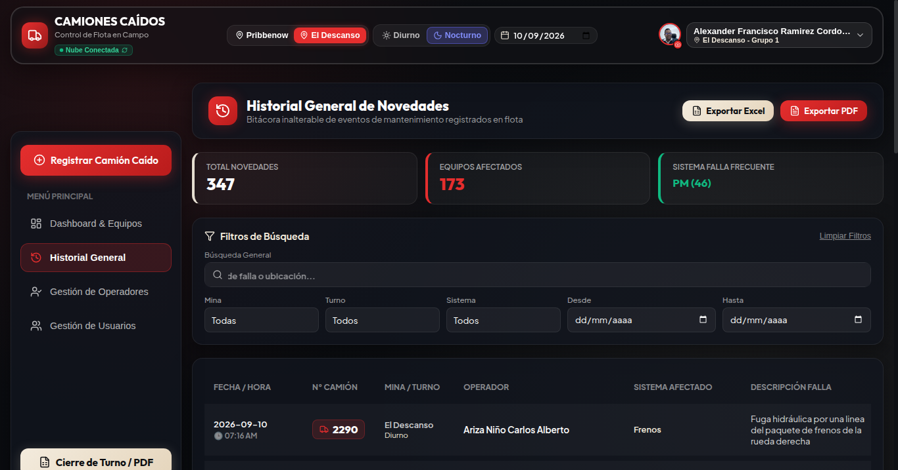
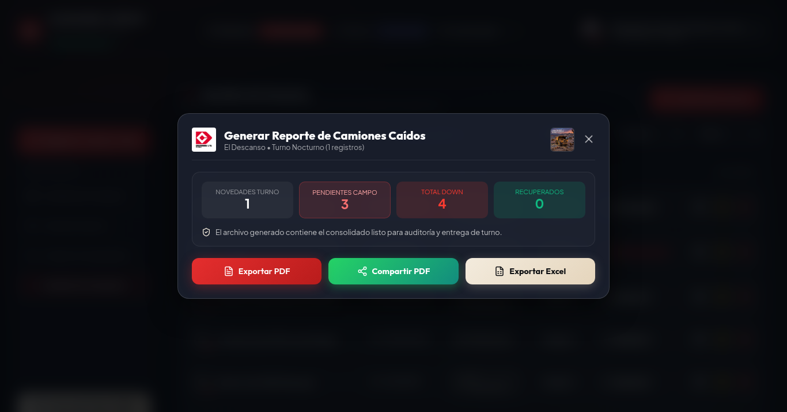

# Camiones Caídos

Manual administrativo
Gestión de usuarios y supervisión de avisos

Mina Pribbenow y Mina El Descanso
Versión documental 1.1 | 27 de septiembre de 2026

## Índice de Contenido

1 Introducción administrativa

2 Roles administrativos y matriz de permisos

3 Administración de usuarios

4 Protecciones administrativas verificadas

5 Política y gestión de contraseñas

6 Administración del censo de operadores

7 Administración de reportes de camiones

8 Control y aislamiento por mina

9 Historial general y por camión

10 Exportaciones en PDF y excel

11 PWA y operación sin conexión

12 Buenas prácticas administrativas

13 Problemas frecuentes y soluciones

14 Procedimiento de soporte básico

15 Supervisión de notificaciones

16 Permisos del dispositivo y diagnóstico de entrega

17 Consulta y actualización de manuales

## 1 Introducción administrativa

El presente Manual Administrativo tiene por objetivo estandarizar la administración y supervisión de la plataforma Camiones Caídos en las operaciones mineras de acarreo en carbón a cielo abierto de Mina Pribbenow y Mina El Descanso.

A través de este documento, el Administrador y el Encargado comprenderán exactamente cómo gestionar cuentas de usuario, mantener depurado el censo de operadores, gobernar la segregación territorial de datos entre minas y coordinar el ciclo de vida de los reportes de camiones caídos.

Las secciones 15 y 16 explican la supervisión de notificaciones y el diagnóstico de entrega. Las capturas son referencias de los módulos existentes; los datos ilustrados no son un inventario actual ni muestran los nuevos controles de notificaciones.

## 2 Roles administrativos y matriz de permisos

El sistema implementa tres niveles de rol, de los cuales dos tienen responsabilidades administrativas y de supervisión:

| Rol | Mina de Operación | Atribuciones Principales | Restricciones de Seguridad |
| --- | --- | --- | --- |
| Administrador | Global (Pribbenow y El Descanso) | Crear, editar y eliminar usuarios; resetear claves; gestionar catálogo de operadores; ver ambas minas; eliminar cualquier reporte; emitir reportes ejecutivos. | Protección contra autoeliminación; no puede eliminar al último administrador del sistema. |
| Encargado | Sede Asignada (Pribbenow o El Descanso) | Capturar y editar camiones caídos; marcar OPERATIVO / DOWN; reabrir reportes; eliminar reportes de su mina; emitir PDF y Excel de su turno. | Sin acceso a Gestión de Usuarios ni Operadores; no puede resetear contraseñas; RLS bloquea consulta de la otra mina. |
| Digitador | Sede Asignada (Pribbenow o El Descanso) | Captura de reportes de campo y actualización de observaciones durante el turno activo. | Sin permisos de eliminación; sin módulos de administración ni reseteo de claves. |

## 3 Administración de usuarios

El módulo de Gestión de Usuarios es de acceso exclusivo para el rol Administrador y se encuentra disponible en la barra superior o menú de navegación.

### 3.1 Directorio Búsqueda Reactiva y Orden A-Z

El directorio lista los usuarios registrados en el sistema. Cuenta con una barra de búsqueda reactiva que filtra en tiempo real por nombre, número de cédula o grupo operativo. El listado se mantiene automáticamente clasificado en orden alfabético A-Z de acuerdo con el nombre del colaborador.

Figura: Directorio Administrativo de Usuarios con Búsqueda y Filtros de Sede

### 3.2 Registro de un Nuevo Usuario Paso a Paso

Para dar de alta a un colaborador en el sistema:

1. En la pestaña Usuarios, pulse el botón rojo '+ Crear Nuevo Usuario'.

2. Nombre Completo (Obligatorio): Ingrese nombre y apellido (mínimo 3 caracteres). El sistema aplicará automáticamente mayúsculas iniciales estándar.

3. Número de Cédula (Obligatorio): Digite la identificación oficial sin puntos ni comas (mínimo 5 dígitos numéricos). Constituye el usuario de login.

4. Rol: Seleccione entre Administrador, Encargado o Digitador según las funciones operacionales del trabajador.

5. Mina: Asigne El Descanso o Pribbenow. Si el rol es Administrador, tendrá alcance a ambas sedes independientemente de la sede base.

6. Grupo: Asigne el grupo de turno correspondiente (Grupo 1, Grupo 2 o Grupo 3).

7. Fotografía / Avatar (Opcional): Permite cargar una foto que se comprime automáticamente en el navegador para no saturar la red.

8. Guardar: Presione 'Guardar Usuario'. Espere la confirmación del servidor y verifique la cuenta en el directorio antes de comunicar el acceso.

### 3.3 Edición de Cuentas Existentes

En la fila o tarjeta del usuario, pulse el botón 'Editar' (icono de lápiz). Podrá modificar el nombre, rol, sede, grupo y fotografía. La cédula permanece inmutable para resguardar la trazabilidad histórica de auditoría.

### 3.4 Restablecimiento Administrativo de Contraseña

Si un usuario olvida su contraseña o es bloqueado por intentos erróneos, el Administrador puede presionar el botón 'Resetear Clave' (icono de llave). Al confirmar, el sistema restablece la clave a la contraseña temporal oficial caidos1234 y activa obligatoriamente la bandera must_change_password.

### 3.5 Eliminación de Cuentas

El botón 'Eliminar' purga coordinadamente al usuario tanto en el módulo de autenticación (Auth) como en la tabla de perfiles de la base de datos.

## 4 Protecciones administrativas verificadas

El sistema incorpora controles de seguridad en el backend (Edge Functions):

1. Detección de Cédula Duplicada: Si se intenta crear un usuario con una cédula que ya existe en app_users o en Auth, el servidor rechaza la transacción con HTTP 409 Conflict y el mensaje: 'El número de identificación ya se encuentra registrado.'

2. Bloqueo de Autoeliminación: Un administrador conectado no puede eliminarse a sí mismo. Si lo intenta, el servidor retorna HTTP 400 Bad Request: 'No es posible eliminarse a sí mismo como administrador.'

3. Protección del Último Administrador: El sistema realiza un conteo previo en la base de datos. Si solo resta un único administrador, se prohíbe su eliminación para evitar dejar la plataforma en estado de orfandad.

SEGURIDAD CRÍTICA: Las funciones de administración verifican estas operaciones en el servidor. No dependa exclusivamente de que un botón esté oculto en la interfaz.

## 5 Política y gestión de contraseñas

La creación y el restablecimiento de contraseñas siguen estas reglas:

Valor Oficial: • Contraseña Temporal Estándar: caidos1234 (verificada idéntica tanto en creación como en reseteo).

Comportamiento: • Bandera de Cambio Obligatorio: Todo usuario nuevo o reseteado queda registrado con must_change_password: true.

Pantalla Bloqueante: • Flujo de Primer Acceso: Al ingresar con caidos1234, la aplicación intercepta la sesión y despliega de inmediato un modal bloqueante que exige definir una contraseña personal.

Reglas de Seguridad: • Requisitos de Contraseña Personal: Mínimo 6 caracteres; confirmación coincidente obligatoria; no se admite volver a usar la clave temporal caidos1234.

Figura: Pantalla de Inicio de Sesión Institucional por Cédula y Contraseña

## 6 Administración del censo de operadores

El módulo Gestión de Operadores administra el censo oficial de operadores de camiones de extracción.

Figura: Directorio General de Operadores de Acarreo

• Búsqueda y Filtros: Búsqueda reactiva por nombre, filtro por Mina (Todas, Pribbenow, El Descanso) y filtro por Grupo de Turno (Todos, Grupo 1 a 3).

• Orden A-Z: Clasificación alfabética continua según apellidos y nombres.

• Registro de Operador: Botón '+ Registrar Nuevo Operador', id generado OP-xxx-xxxx, mayúsculas automáticas y estado 'Activo'.

• Reglas de Eliminación: La eliminación física está reservada exclusivamente para el Administrador vía RLS (operators_delete_admin). En la base de datos se conserva el snapshot textual en todos los reportes históricos previos.

## 7 Administración de reportes de camiones

El control de flota en campo se realiza desde el Dashboard principal:

Figura: Modal de Captura y Registro de Falla en Camión de Acarreo

• Creación: Botón '+ Registrar Camión Caído'. Se selecciona el número de camión (serie 2xxx de 4 dígitos), se autocompleta el operador desde el censo oficial, se selecciona subsistema mecánico/eléctrico, componente, síntoma, bahía/Pit y hora de caída.

• Transición DOWN / OPERATIVO: Los camiones caídos inician en estado DOWN. Al repararse, el Encargado presiona 'Operativo', registra la hora real de retorno y confirma la salida a circuito.

• Reapertura: Use Reabrir para corregir el estado del mismo reporte cuando fue marcado OPERATIVO por error. Registre una nueva novedad si se trata de otra falla, para conservar la trazabilidad.

• Eliminación según Rol: El Administrador puede eliminar cualquier reporte erróneo. El Encargado puede eliminar reportes únicamente si pertenecen a su propia mina. El Digitador tiene la eliminación bloqueada.

## 8 Control y aislamiento por mina

La plataforma opera bajo el principio de estricta segregación minera:

• Mina Pribbenow y Mina El Descanso cuentan con Pit, flotas y despachos independientes.

• Los Encargados y Digitadores tienen restringida su vista mediante Row Level Security (mine = get_auth_user_mine()). Un encargado de El Descanso no puede ver ni modificar datos de Pribbenow.

• El Administrador dispone de un selector global en el encabezado para alternar entre minas o supervisar la operación consolidada.

## 9 Historial general y por camión

La bitácora de eventos ofrece trazabilidad completa de paradas:

Figura: Historial General de Camiones Caídos con Filtros Compuestos

• Regla Cronológica Oficial: 1. Fecha en orden DESCENDENTE (días más recientes arriba); 2. Dentro del mismo día, hora en orden ASCENDENTE (del inicio del turno al final).

• Historial por Camión: Al pulsar sobre el número de una unidad se abre su ficha técnica, mostrando la línea de tiempo de paradas y alertando sobre el subsistema más recurrente (detección de fallas crónicas).

Figura: Historial General desde el que se consulta una unidad

## 10 Exportaciones en PDF y excel

La plataforma permite emitir documentos oficiales con un solo clic:

Figura: Ventana de Configuración y Emisión de Cierre de Turno en PDF

• PDF Oficial: Informe gerencial con membretes corporativos Drummond y CAT en alta resolución, resumen de disponibilidad, horas de parada y detalle con snapshot de operador.

• Compartir Móvil: En celulares y tabletas, incluye el botón 'Compartir PDF (1 Clic)' mediante la Web Share API para abrir el menú de compartir en dispositivos compatibles; el usuario elige la aplicación y confirma el envío. Si no se admite, descargue y adjunte el PDF manualmente.

• Excel (XLSX): Genera un libro estructurado en dos hojas: 'Novedades Turno' y 'Pendientes Campo', listo para análisis estadístico y conciliación en hojas de cálculo.

Figura: Descarga de Libro Excel con Hojas de Novedades y Pendientes

## 11 PWA y operación sin conexión

• Instalación en Móviles: Aplicación Web Progresiva instalable directamente desde Chrome (Android) o Safari (iOS) sin pasar por tiendas de aplicaciones.

• Consulta en Pit Sin Señal: Los reportes del turno y el censo de operadores se mantienen en el almacenamiento local del dispositivo (localStorage).

• Persistencia de Sesión: Ante fallos de conexión, la aplicación puede conservar el perfil previamente validado para consulta; esto no sustituye la validación de permisos al recuperar el servicio.

• Sincronización al Retorno: Al detectar señal de red o Wi-Fi minero, la aplicación revalida silenciosamente los datos con el servidor central.

Figura: Interfaz Móvil Adaptativa para Uso en Terreno

El modo sin conexión permite consultar datos previamente cargados y potencialmente desactualizados. No hay una cola de escritura offline que garantice guardar reportes al volver la señal. Espere confirmación del servidor al crear, editar o cambiar un estado. No reitere registros sin comprobar si el servidor ya los recibió.

## 12 Buenas prácticas administrativas

1. Entrega Segura de Claves Temporales: Comunique la contraseña caidos1234 de manera directa y personal al colaborador. Recuérdele que el sistema le obligará a crear una clave propia.

2. Conciliación en Relevo de Turno: Antes de cerrar el turno diurno (18:00) o nocturno (06:00), el Encargado debe verificar que todas las unidades en taller estén marcadas como DOWN o tengan registrada su hora de salida a circuito.

3. Depuración del Censo: Modifique los operadores únicamente ante traslados de grupo o desvinculaciones formales.

4. Cierre de Sesión en Terminales de Despacho: En computadores compartidos de oficina, cierre siempre la sesión desde el menú de perfil para proteger la auditoría de registros.

## 13 Problemas frecuentes y soluciones

| Síntoma Observado | Causa Probable | Acción Administrativa Inmediata |
| --- | --- | --- |
| Error 409 al crear usuario | La cédula ya está registrada en el sistema. | Verifique el número de cédula en el directorio de usuarios. Si el colaborador ya existe, edite su perfil en lugar de crearlo de nuevo. |
| Usuario no puede entrar tras reset | Ingresó cédula con puntos o escribió mal la clave temporal. | Indique al usuario que escriba la cédula sin símbolos y la clave en minúsculas: caidos1234. Si persiste, ejecute un nuevo reset. |
| Encargado no ve camiones de otra mina | Comportamiento normal por política de aislamiento RLS. | Los encargados solo tienen visión sobre su mina asignada. Si necesita otro alcance, solicite una revisión de permisos al responsable. No cambie el rol solo para resolver un aviso ausente. |
| No permite eliminar a un usuario | Intento de autoeliminación o de borrar al único administrador. | El sistema protege la cuenta del usuario en sesión y salvaguarda al último administrador para evitar pérdida de gobernanza. |
| Reportes no sincronizan en campo | Pérdida de cobertura de datos móviles en el Pit. | La aplicación continuará en modo consulta offline. Al retornar a zona con señal de red, verifique los datos actualizados; los cambios no confirmados deben revisarse antes de reintentarlos. |

## 14 Procedimiento de soporte básico

Cuando una novedad operativa no pueda resolverse desde las funciones del panel administrativo:

1. Registre los datos del incidente: Cédula del colaborador afectado, mina, hora aproximada y captura de pantalla del mensaje de error.

2. Verifique conectividad del equipo: Valide si otros servicios web cargan con normalidad en la terminal.

3. Escalamiento a Nivel 3: Envíe el reporte al equipo técnico de soporte indicando el código de respuesta HTTP observado.

## 15 Supervisión de notificaciones

La campana es personal, también para un Administrador. Permite consultar tarjetas, abrir detalles y marcar avisos como leídos; no ofrece una consola para leer las campanas de otros usuarios, certificar entregas, enviar campañas o reprogramar alertas.

La carga inicial muestra los 30 avisos más recientes. El contador se deriva de los avisos cargados sin leer y puede crecer con nuevas entradas; no representa todo el historial. Marcar leídas solicita actualizar todos los avisos pendientes del usuario. La lectura no cierra ni modifica reportes.

### Reglas de destinatarios

Nuevo reporte y cambio de estado: usuarios activos de la mina del reporte que pertenezcan al grupo del actor, más administradores activos globales; se excluye al autor. Los destinatarios deben tener cuenta de autenticación asociada. Un Administrador puede recibir avisos de ambas minas aunque su perfil indique una sede base.

El grupo del evento operacional se toma del perfil del actor; no se calcula a partir del turno del reloj. Revise la asignación de mina y grupo al crear o trasladar usuarios. Cambiar filtros del tablero no modifica las reglas de recepción.

El aviso se solicita después de confirmar el guardado y usa datos del reporte almacenado. Un fallo de notificación no demuestra que el reporte no se haya guardado. Antes de repetir una captura, consulte el tablero para evitar duplicados.

### Cortes de cambio de turno

Las evaluaciones previstas son 06:30 para el turno Diurno y 18:30 para el Nocturno, hora de Colombia. La rotación determina el grupo entrante. Cada mina se evalúa por separado; reciben el aviso sus usuarios activos del grupo entrante y los administradores activos globales.

Para el corte de las 06:30 se consideran reportes con fecha operativa anterior. Para las 18:30 se incluyen fechas anteriores y reportes diurnos del mismo día. De ese conjunto se toma el reporte más reciente por camión según su creación; solo se incluye si está DOWN y se clasifica en campo.

La clasificación excluye textos que identifican taller o bahía, incluidas variantes reconocidas por el sistema. Una ubicación vacía se considera campo; registre ubicaciones claras para evitar clasificaciones equivocadas. Si no hay camiones elegibles, no se genera alerta para esa mina.

El corte no considera nuevos reportes originados en el turno entrante para sustituir los de turnos anteriores. Si detecta una discrepancia, conserve ambos identificadores para que soporte contraste el caso. El aviso es una fotografía del corte, no un estado permanente.

## 16 Permisos del dispositivo y diagnóstico de entrega

Cada usuario debe abrir su menú de perfil y activar las alertas en el dispositivo que utilizará. El Administrador no puede conceder remotamente el permiso del navegador. En iPhone, siga la indicación de agregar a Pantalla de Inicio y abrir la app instalada.

Activas confirma la suscripción del navegador vinculada a la cuenta en el servidor. No certifica la recepción de cada aviso. Desactivar Alertas actúa sobre ese dispositivo; la campana permanece disponible. Ante limpieza parcial aparece Reintentar desactivación; ante estado desconocido, Comprobar de nuevo.

El cierre de sesión intenta limpiar la suscripción. Un fallo muestra una advertencia y permite cerrar sesión; no debe registrarse como desactivación confirmada. En terminales compartidas, revise los permisos del sitio y escale la limpieza pendiente.

### Secuencia de revisión

1. Identifique el evento: reporte, cambio de estado o corte de turno; registre mina, grupo, camión y fecha. Confirme que el reporte existe y tiene el estado esperado.

2. Confirme que el usuario cumple la regla de destinatarios y no es el autor excluido. Revise sus datos de perfil sin cambiar roles para forzar la recepción.

3. Consulte la campana de la propia cuenta afectada con ayuda del usuario. Si aparece allí, la generación del aviso y la presentación push requieren diagnósticos distintos.

4. Revise conexión, estado Activas, permisos del sitio y ajustes de presentación del dispositivo. Ante un mensaje de reparación, el usuario debe volver a activar explícitamente.

5. Si no se resuelve, escale a soporte técnico con hora, navegador, dispositivo y mensaje observado. Soporte deberá revisar ejecución, destinatarios y resultado del emisor. No solicite contraseñas, tokens ni claves de suscripción.

Las pruebas que creen reportes o envíen avisos requieren acordar previamente entorno, cuentas y destinatarios. No use la operación como entorno de prueba implícito. La aplicación no ofrece garantía de entrega inmediata ni reenvío automático de todos los push fallidos.

## 17 Consulta y actualización de manuales

Desde el menú del nombre, Administrador y Encargado pueden abrir el Manual de Usuario y el Manual Administrativo. El Digitador accede al Manual de Usuario. Para obtener el documento se necesita conexión y una sesión válida.

Si el enlace no abre o muestra un error, vuelva a solicitarlo desde el menú. No reutilice enlaces antiguos como acceso permanente. La publicación de nuevas versiones debe coordinarse con el responsable técnico; editar un archivo local no actualiza el manual disponible en la aplicación.
