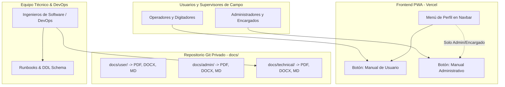

# L10.4.1 — DISEÑO DE ALMACENAMIENTO Y DISTRIBUCIÓN DE DOCUMENTACIÓN OFICIAL

**Proyecto:** Camiones Caídos — Control de Flotas en Campo  
**Fase:** L10.4.1 — Análisis y Diseño de Distribución Documental (Solo Lectura)  
**Fecha:** 2026-09-11 (Local: 2026-09-10 23:30:00 -05:00)  
**Versión Documental:** 1.0  
**Commit Base:** `74ca1683e6034a81a73b94cabdd371a30c98b47d` (HEAD -> main, origin/main)  
**Estado del Repositorio:** 100% LIMPIO (Análisis de solo lectura; sin modificaciones)  

---

## A. Estado Actual

Actualmente, los entregables documentales definitivos de la plataforma se encuentran generados y resguardados **fuera del repositorio de código**, dentro del directorio de scratch (`/home/pechi415/.gemini/antigravity-ide/brain/3716dd0b-f23d-4832-8b2c-0fadb8c929b0/scratch/`):

1. **Manual de Usuario (L10.2):**
   - `L10.2_MANUAL_USUARIO_CAMIONES_CAIDOS.pdf` (14 páginas, 3.3 MB)
   - `L10.2_MANUAL_USUARIO_CAMIONES_CAIDOS.docx` (3.8 MB)
   - `L10.2_MANUAL_USUARIO_CAMIONES_CAIDOS.md` (5.8 kB)
2. **Manual Administrativo (L10.3):**
   - `L10.3_MANUAL_ADMINISTRATIVO_CAMIONES_CAIDOS.pdf` (11 páginas, 2.9 MB)
   - `L10.3_MANUAL_ADMINISTRATIVO_CAMIONES_CAIDOS.docx` (3.3 MB)
   - `L10.3_MANUAL_ADMINISTRATIVO_CAMIONES_CAIDOS.md` (13 kB)
3. **Manual Técnico (L10.3):**
   - `L10.3_MANUAL_TECNICO_CAMIONES_CAIDOS.pdf` (7 páginas, 536 kB)
   - `L10.3_MANUAL_TECNICO_CAMIONES_CAIDOS.docx` (458 kB)
   - `L10.3_MANUAL_TECNICO_CAMIONES_CAIDOS.md` (19 kB)

### Configuración Vigente del Frontend y Despliegue
- **Carpeta `public/`:** Contiene exclusivamente 9 archivos de soporte gráfico (iconos PWA, favicons y logotipos corporativos en PNG/JPG, sumando ~1.0 MB).
- **Vite & PWA (`vite.config.js`):** Utiliza `vite-plugin-pwa` con Workbox 7 en modo `autoUpdate`. Precachea 26 entradas estáticas obligatorias (`dist/sw.js`, tamaño de precache: **2,314.69 KiB**).
- **Vercel (`vercel.json`):**
  ```json
  {
    "rewrites": [
      { "source": "/(.*)", "destination": "/index.html" }
    ]
  }
  ```
  En la arquitectura de Vercel, cualquier archivo ubicado en la carpeta `dist/` es servido como activo estático público con prioridad sobre las reglas de reescritura. Vercel no aplica capas de autenticación a archivos estáticos sin un servidor intermedio o middleware.
- **Navegación e Interfaz (`Navbar.jsx`, `NavUserProfile.jsx`, `MobileNav.jsx`):**
  - La aplicación no dispone actualmente de una opción de "Ayuda", "Documentación" o visor de manuales en la barra de navegación ni en el menú de perfil de usuario.
  - `MobileNav.jsx` es un componente estrictamente protegido con física de fluidos inercial (`LiquidLensCanvas.jsx`) dimensionada para un número exacto de botones táctiles.

---

## B. Alternativas Evaluadas

Se analizaron cuatro opciones arquitectónicas para ubicar y distribuir los manuales:

### Opción 1: Repositorio en Carpeta `public/docs/`
- **Mecanismo:** Colocar los archivos PDF dentro de `public/docs/` en el proyecto.
- **Comportamiento en Compilación:** Durante el comando `npm run build`, Vite copia intacto todo el contenido de `public/` hacia `dist/docs/`.
- **Comportamiento en Vercel:** Los documentos son desplegados automáticamente en la CDN y quedan expuestos en rutas públicas:
  - `https://<dominio>/docs/manual_usuario.pdf`
  - `https://<dominio>/docs/manual_administrativo.pdf`
  - `https://<dominio>/docs/manual_tecnico.pdf`
- **Implicación de Seguridad Crítica:**
  > [!CAUTION]
  > **ACCESO PÚBLICO IRRESTRINGIDO:** Cualquier archivo colocado en `public/` es accesible de forma anónima mediante su URL directa en Internet.
  > Aunque en la interfaz de React se "oculte el botón" a usuarios no administradores, el archivo físico sigue siendo accesible por cualquier persona que adivine o conozca la ruta, sin solicitar login ni validar tokens JWT.
- **Impacto en PWA:** Si Workbox precachea los PDFs o el navegador los descarga en background, el tamaño de la aplicación pasaría de 2.3 MB a casi 10 MB, afectando la cuota de almacenamiento móvil y la velocidad de arranque.
- **Veredicto:** **INACEPTABLE para Manual Administrativo y Técnico**. Solo admisible para el Manual de Usuario si se decidiera que es 100% público.

---

### Opción 2: Repositorio en Carpeta `docs/` (Fuera de `public/`)
- **Mecanismo:** Crear un directorio `docs/` en la raíz del repositorio Git, paralelo a `src/`.
- **Comportamiento en Compilación:** Vite y Rollup ignoran completamente los archivos fuera de `src/` y `public/`. Los archivos **NO se copian a `dist/`** y **NO son publicados por Vercel**.
- **Ventajas:**
  - Control de versiones estricto en Git (historial de commits, ramas y trazabilidad).
  - Cero riesgo de exposición pública en Internet.
  - Cero impacto en el bundle de producción, en el precache PWA y en los tiempos de carga del frontend.
- **Desventajas:** Los usuarios finales no pueden acceder a estos archivos desde la interfaz web o el teléfono celular sin un mecanismo adicional de entrega.
- **Veredicto:** **ALTAMENTE RECOMENDADO para Manual Técnico** y para los archivos fuente editables (`.docx` y `.md`) de todos los manuales.

---

### Opción 3: Supabase Storage con Políticas de Acceso RLS
- **Mecanismo:** Alojar los PDFs en buckets dedicados de Supabase Storage:
  - Bucket `public-docs`: Para el Manual de Usuario (descarga pública o autenticada directa).
  - Bucket `protected-docs` (Privado): Con políticas RLS en `storage.objects` que validen rol (`Administrador` o `Encargado`) y entrega mediante URLs firmadas de corta duración (`createSignedUrl` de 60 segundos).
- **Ventajas:**
  - **Seguridad Real en Capa de Datos:** No se depende del frontend para proteger el archivo; el backend de Supabase rechaza solicitudes no autorizadas a nivel de storage.
  - **Acceso Directo desde la PWA:** Los usuarios autenticados pueden abrir el PDF directamente en su dispositivo móvil con un clic.
  - **Cero Impacto en el Bundle de Vite:** Los manuales no aumentan los megabytes de compilación del frontend en Vercel ni inflan el precache de Workbox.
- **Desventajas:**
  - Requiere conexión a Internet para solicitar la URL firmada (o requiere almacenamiento local en el visor del dispositivo).
  - Requiere configuración de storage y políticas en Supabase.
- **Veredicto:** **ÓPTIMO para distribución controlada del Manual Administrativo** en una fase evolutiva.

---

### Opción 4: Entrega Dentro de la Aplicación (Menú de Perfil / Modal)
- **Mecanismo:** Incorporar enlaces de descarga o visualización en la interfaz web existente:
  - En `NavUserProfile.jsx` (menú desplegable del usuario en desktop y móvil):
    - Opción visible para todos los usuarios autenticados: *"Manual de Usuario"*.
    - Opción visible únicamente si `isAdmin || isEncargado`: *"Manual Administrativo"*.
- **Distinción Técnica Fundamental:**
  > [!IMPORTANT]
  > **"Ocultar Enlace" NO Equivale a "Proteger Documento"**:
  > Condicionar la visibilidad en React (`{isAdmin && <button>...}`) únicamente oculta el elemento visual en el DOM.
  > Para que la protección sea efectiva, el recurso subyacente debe provenir de una fuente privada autenticada (Supabase Storage privado con RLS o Edge Function) o residir fuera del frontend.

---

## C. Clasificación de Seguridad de los Documentos

| Documento | Clasificación Formal | Audiencia Permitida | Riesgo si se Expone | Ubicación Recomendada |
| :--- | :---: | :--- | :--- | :--- |
| **Manual de Usuario** | **AUTENTICADO** | Todos los usuarios logueados (Admin, Encargado, Digitador). | **Bajo:** Describe la operación normal en campo y captura de datos. | Publicable en frontend autenticado o estático protegido. |
| **Manual Administrativo** | **ADMIN-ENCARGADO** | Exclusivo Administradores y Encargados de turno. | **Medio-Alto:** Contiene claves temporales (`caidos1234`), políticas de gestión de usuarios, reseteos de credenciales y reglas de gobernanza. | Privado. Servido bajo control de rol o distribuido por canales corporativos internos. |
| **Manual Técnico** | **SOLO TÉCNICO** | Desarrolladores, DevOps, Infraestructura y Soporte L3. | **Crítico:** Documenta arquitectura interna, esquemas DDL, triggers de inmutabilidad, runbooks de incidentes y estructura de secrets. | **Estrictamente fuera del frontend público.** Solo en Git privado y documentación de entrega técnica. |

---

## D. Impacto en PWA y Rendimiento de Red

1. **Tamaño Actual del Precache Workbox:**
   - 26 activos estáticos = **2,314.69 KiB** (~2.31 MB).
2. **Impacto si se precachearan los PDFs:**
   - Manual de Usuario: +3.3 MB
   - Manual Administrativo: +2.9 MB
   - Manual Técnico: +0.5 MB
   - **Total Incremento:** +6.7 MB ($\approx$ **390% de incremento** en el precache inicial).
3. **Efectos Negativos en Operaciones de Campo:**
   - Saturación innecesaria del plan de datos celulares en los teléfonos de los operadores en el tajo.
   - Demoras prolongadas en la primera carga y activación del Service Worker (`dist/sw.js`).
   - Mayor riesgo de fallos por cuota de almacenamiento en navegadores móviles reducidos.
4. **Directriz Técnica Obligatoria:**
   > [!WARNING]
   > Ningún archivo PDF o documento de manual debe ser incluido en `includeAssets` ni en los patrones de precaching de `vite.config.js`. Su descarga debe ser estrictamente bajo demanda (*lazy download / on-demand*).

---

## E. Política de Versionado y Ciclo de Vida Documental

Para evitar duplicidad, inconsistencias y documentos huérfanos entre releases:

1. **Versión Documental Vinculada al Release:**
   - La documentación no debe inventar números de versión independientes; debe llevar la **Versión Documental 1.0** asociada a la fecha **10 de septiembre de 2026** y al commit base auditado `74ca1683e6034a81a73b94cabdd371a30c98b47d`.
2. **Estructura Jerárquica de Carpetas en el Repositorio (`docs/`):**
   ```text
   docs/
   ├── user/
   │   ├── L10.2_MANUAL_USUARIO_CAMIONES_CAIDOS.pdf
   │   ├── L10.2_MANUAL_USUARIO_CAMIONES_CAIDOS.docx
   │   └── L10.2_MANUAL_USUARIO_CAMIONES_CAIDOS.md
   ├── admin/
   │   ├── L10.3_MANUAL_ADMINISTRATIVO_CAMIONES_CAIDOS.pdf
   │   ├── L10.3_MANUAL_ADMINISTRATIVO_CAMIONES_CAIDOS.docx
   │   └── L10.3_MANUAL_ADMINISTRATIVO_CAMIONES_CAIDOS.md
   ├── technical/
   │   ├── L10.3_MANUAL_TECNICO_CAMIONES_CAIDOS.pdf
   │   ├── L10.3_MANUAL_TECNICO_CAMIONES_CAIDOS.docx
   │   └── L10.3_MANUAL_TECNICO_CAMIONES_CAIDOS.md
   └── reports/
       ├── L10.1_AUDITORIA_FINAL_FUNCIONAL.md
       ├── L10.2.1_ANALISIS_MANUAL_USUARIO.md
       ├── L10.3.1_ANALISIS_MANUAL_ADMINISTRATIVO.md
       ├── L10.3.1_ANALISIS_MANUAL_TECNICO.md
       └── L10.3.2_REPORTE_GENERACION_MANUALES.md
   ```

---

## F. Política de Gestión de Archivos Editables y Binarios

| Tipo de Archivo | Rol del Formato | ¿Debe entrar a Git? | Justificación Técnica |
| :---: | :--- | :---: | :--- |
| **`.md` (Markdown)** | **Fuente Maestra de Texto:** Estructura pura, trazabilidad en control de versiones y visualización en GitHub. | **SÍ** | Es texto plano liviano; permite diffs línea por línea en pull requests y auditorías. |
| **`.docx` (Word)** | **Fuente Editable de Diagramación:** Plantilla para futuras modificaciones estéticas, corporativas o de maquetación. | **SÍ** (en `docs/`) | Preserva estilos, márgenes A4 y estructura de tablas sin depender de software especializado. |
| **`.pdf` (PDF)** | **Documento Final de Distribución:** Versión oficial no editable, lista para visualización e impresión. | **SÍ** (en `docs/`) | Asegura que cualquier persona con acceso al repositorio disponga de los binarios certificados del release. |

---

## G. Tabla Comparativa de Alternativas

| Criterio de Evaluación | Opción A: `public/docs/` (Vercel Estático) | Opción B: `docs/` en Repositorio Git | Opción C: Supabase Storage con RLS | Opción D: Menú de Aplicación (UI) |
| :--- | :---: | :---: | :---: | :---: |
| **Seguridad de Acceso** | NULA (URL pública en Internet) | MÁXIMA (Solo colaboradores con acceso al repo) | ALTA (Protegido por token JWT y roles RLS) | DEPENDE (De la fuente del archivo) |
| **Facilidad para Usuarios PWA** | Inmediata (clic en enlace) | Nula (usuarios de campo no usan Git) | Excelente (descarga directa autenticada) | Excelente (integrado en el flujo de trabajo) |
| **Mantenimiento y Actualización** | Requiere nuevo deploy del frontend | Versionado limpio en commits de Git | Actualización de archivos en bucket sin re-deploy | Requiere coordinar frontend y almacenamiento |
| **Impacto en Rendimiento / Precache** | ALTO si se copia en el build | CERO (queda fuera del empaquetado) | CERO (se consume bajo demanda externa) | CERO (lazy loading) |
| **Control por Rol (Admin vs Usuario)** | Imposible a nivel de red | Controlado por permisos de repositorio | Implementable mediante políticas de storage | Visual en interfaz (requiere respaldo de red) |
| **Riesgo de Exposición de Secretos** | ALTO para manuales admin/técnicos | NULO en repositorios privados | NULO con bucket privado | NULO si no enlaza a rutas públicas |
| **Recomendación para Manual Usuario** | Viable (con precaución) | No suficiente para el usuario final | Viable y escalable | **RECOMENDADA (enlace en perfil)** |
| **Recomendación para Manual Admin** | **PROHIBIDA** | Excelente para resguardo | Viable para descarga en app | **RECOMENDADA (solo rol Admin/Encargado)** |
| **Recomendación para Manual Técnico** | **PROHIBIDA** | **RECOMENDADA AL 100%** | Innecesaria para soporte técnico | **PROHIBIDA en la PWA** |

---

## H. Arquitectura Recomendada de Distribución

Para balancear la máxima facilidad de consulta operativa en campo con una rigurosa protección de la información administrativa y técnica, se propone la siguiente arquitectura:



### Respuestas a las 10 Preguntas Obligatorias de la Arquitectura:

1. **¿Dónde queda el Manual de Usuario?**
   - *Resguardo Maestro:* En el repositorio Git dentro de `docs/user/`.
   - *Distribución a Campo:* Disponible para los usuarios autenticados mediante una opción en el menú de perfil de usuario (`NavUserProfile.jsx`) o a través de un visualizador/descarga controlada.
2. **¿Cómo lo abre el usuario?**
   - Desde la aplicación web o PWA instalada, el usuario pulsa su foto/nombre en la esquina superior derecha del Navbar y selecciona la opción *"Manual de Usuario"*, abriendo el PDF en una pestaña del navegador o descargándolo al almacenamiento de su teléfono.
3. **¿Dónde queda el Manual Administrativo?**
   - *Resguardo Maestro:* En el repositorio Git dentro de `docs/admin/`.
   - *Distribución Controlada:* Disponible exclusivamente para usuarios con rol verificado `Administrador` o `Encargado`.
4. **¿Cómo lo abre un Administrador / Encargado?**
   - Aparece condicionado en su menú de perfil (`isAdmin || isEncargado`) con la etiqueta *"Manual Administrativo"*. Para usuarios con rol `Digitador`, este enlace **no se renderiza**.
5. **¿Dónde queda el Manual Técnico?**
   - Queda archivado **exclusivamente** en el repositorio Git dentro de `docs/technical/` y en el paquete de entrega formal del proyecto.
   - **NO se publica en Vercel, NO se expone en la PWA y NO se sube a carpetas públicas.**
6. **¿Cómo accede el responsable técnico?**
   - Directamente a través del repositorio privado de GitHub en la rama `main` o clonando el repositorio localmente.
7. **¿Qué archivos entran a Git?**
   - Todos los formatos de los manuales (`.md`, `.docx`, `.pdf`) ubicados dentro de la carpeta raíz `docs/` (fuera de `public/` y fuera de `src/`).
   - Los reportes de auditoría generados en las fases L10.1, L10.2 y L10.3 en `docs/reports/`.
8. **¿Qué archivos NO entran a Git?**
   - Archivos temporales de generación (`scratch/*.html`, scripts temporales de node o python en scratch).
   - Variables de entorno locales con credenciales reales (`.env` permanece en `.gitignore`).
   - Ningún PDF copiado dentro de `public/`.
9. **¿Qué archivos quedan publicados?**
   - Ningún archivo se publica de manera anónima o desprotegida en la web.
   - El Manual de Usuario se distribuye exclusivamente a sesiones activas.
10. **¿Qué archivos quedan privados?**
    - El Manual Administrativo (restringido a supervisores).
    - El Manual Técnico (restringido al personal de ingeniería y DevOps).
    - Todos los esquemas DDL y runbooks de contingencia.

---

## I. Plan de Implementación Propuesto (Fase Futura L10.4.2)

Una vez aprobada esta propuesta por el usuario, la implementación física se estructurará en los siguientes pasos controlados:

1. **Creación de la Estructura `docs/` en el Repositorio:**
   - Crear las carpetas `docs/user/`, `docs/admin/`, `docs/technical/` y `docs/reports/`.
   - Copiar los archivos `.md`, `.docx` y `.pdf` correspondientes desde `scratch/` hacia su ubicación definitiva en `docs/`.
2. **Actualización de `.gitignore`:**
   - Confirmar que la carpeta `docs/` esté permitida para seguimiento de Git y que los archivos temporales de scratch continúen excluidos.
3. **Integración en la Interfaz de Usuario (Opcional si se autoriza):**
   - Si se autoriza la descarga desde la app: integrar los botones en `NavUserProfile.jsx` asegurando que no alteren la física de navegación móvil de `MobileNav.jsx`.
   - Definir si el servicio del archivo se hace mediante importación dinámica de blob, ruta estática autenticada o Supabase Storage.
4. **Verificación de Compilación y PWA:**
   - Ejecutar `npm run build` para certificar que el tamaño de precache del Service Worker (26 entradas, ~2.31 MB) **no sufra incrementos**.

---

## J. Riesgos Identificados

1. **Riesgo de Fuga por Almacenamiento Estático Inseguro:** Si se optara erróneamente por colocar los PDFs en `public/docs/`, la URL sería indexable o adivinable por cualquier atacante, exponiendo las contraseñas temporales y procedimientos de gobernanza del Manual Administrativo.
2. **Riesgo de Degradación del Desempeño Móvil:** Si los archivos binarios de los manuales llegaran a integrarse en el precache de Workbox, los operadores en zonas de baja cobertura celular (tajo abierto) experimentarían tiempos de recarga lentos o fallos en la actualización del Service Worker.
3. **Riesgo de Obsolescencia Documental:** Mantener versiones desconectadas del commit de release podría generar confusión si el software evoluciona en futuras fases. La vinculación explícita con el commit `74ca168` mitiga este riesgo.

---

## K. Decisiones que Requieren Confirmación del Usuario

Antes de proceder a la fase de implementación L10.4.2, se requiere la validación de los siguientes puntos:

1. **Aprobación de la Estructura en Repositorio:** ¿Se aprueba almacenar los manuales definitivos en la carpeta `docs/` en la raíz del repositorio de Git?
2. **Alcance de la Integración en la Interfaz:** ¿Desea que el Manual de Usuario y el Manual Administrativo se puedan descargar directamente desde el menú de usuario de la aplicación, o prefiere que la documentación se distribuya exclusivamente como archivos fuera de la PWA (por canales corporativos de Drummond)?
3. **Exclusión Absoluta del Manual Técnico del Frontend:** ¿Queda confirmado que el Manual Técnico permanecerá estrictamente en el repositorio Git y no tendrá ningún enlace en la interfaz de usuario?
