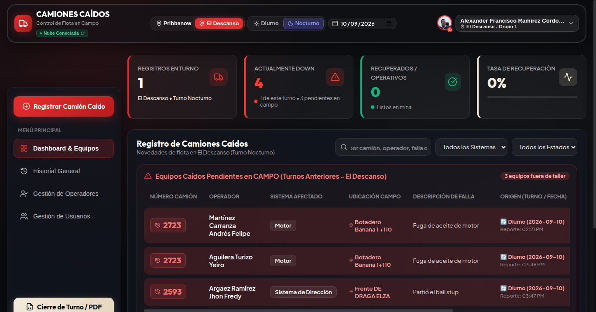
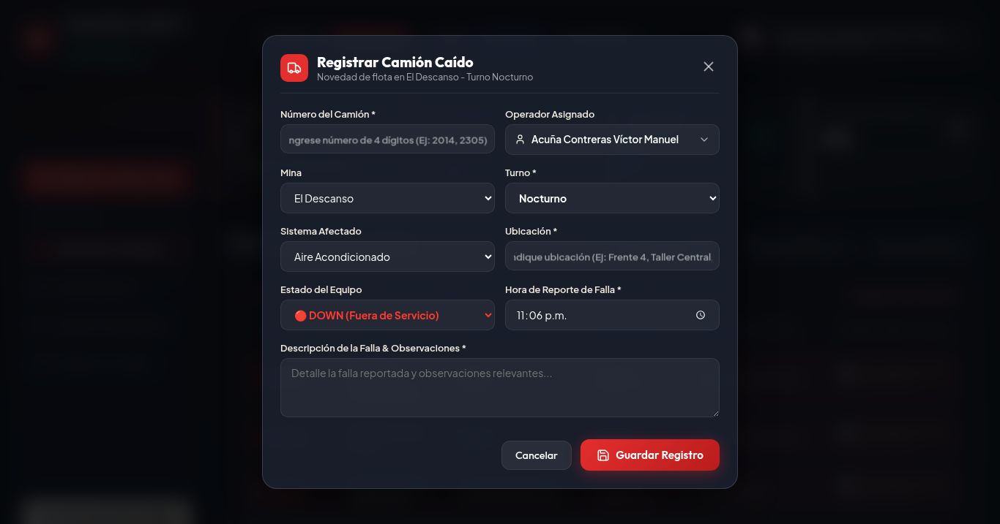
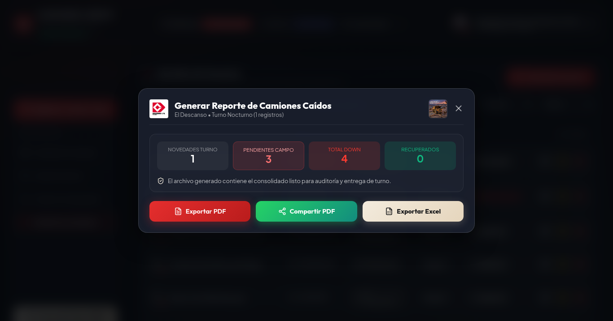
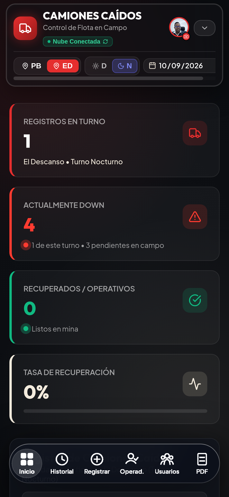

# Camiones Caídos

Manual de usuario
Registro de reportes y notificaciones

Mina Pribbenow y Mina El Descanso
Versión documental 1.1 | 27 de septiembre de 2026

## Contenido del Manual

1 Qué es camiones caídos

2 Ingreso a la aplicación

3 Roles y permisos en el sistema

4 Panel de control dashboard y equipos

5 Cómo registrar un camión caído

6 Actualizar estado DOWN a OPERATIVO

7 Historial general de novedades

8 Historial de vida por camión

9 Gestión de operadores solo administrador

10 Gestión de usuarios solo administrador

11 Generar reporte oficial en PDF cierre de turno

12 Exportar datos a excel XLSX

13 Uso en celular y modo fuera de línea PWA

14 Cierre de sesión seguro

15 Problemas frecuentes y soluciones

16 Recomendaciones operativas y contacto

17 Notificaciones dentro de la aplicación

18 Alertas en este dispositivo

19 Resolver problemas de notificaciones

## 1 Qué es camiones caídos

Camiones Caídos es una aplicación digital diseñada para el control ágil y riguroso de las novedades mecánicas, eléctricas e hidráulicas que obligan a detener los camiones de extracción minera (Flota CAT 793 y equipos de acarreo afines) en las operaciones de Mina Pribbenow y Mina El Descanso.

El sistema reemplaza las planillas manuales de papel y los registros dispersos en radio, centralizando la información operativa para que el personal de producción tome decisiones con datos confiables.

Beneficio Clave: La aplicación funciona tanto en computadores de escritorio en estaciones de despacho como en teléfonos celulares y tabletas en pleno tajo minero, permitiendo consultar datos previamente cargados cuando la conectividad es intermitente. Para guardar reportes y cambios se necesita conexión y confirmación del servidor; no hay una cola de guardado fuera de línea.

Esta guía explica el registro y consulta de novedades. Las secciones 17 a 19 describen la campana, las alertas del dispositivo y cómo resolver problemas. Las capturas son referencias de los módulos existentes; sus datos no representan el estado actual de la operación ni muestran los nuevos controles de notificaciones.

## 2 Ingreso a la aplicación

Para acceder al sistema no requiere instalar programas complejos; basta con abrir el enlace de la aplicación desde Google Chrome, Microsoft Edge o Safari en su computador o teléfono móvil.

Pasos para Iniciar Sesión:
1. En la pantalla inicial, ubique el campo 'Número de Identificación (Cédula)'. Digite únicamente los números de su documento (sin puntos ni espacios).
2. Ingrese su 'Contraseña' en el campo inferior. Puede usar el ícono del ojo para verificar lo digitado.
3. Haga clic o pulse en el botón rojo 'Iniciar Sesión'.

Figura: Pantalla Oficial de Inicio de Sesión de Camiones Caídos

Situaciones Especiales al Ingresar:
• Contraseña Incorrecta o Cédula no registrada: Aparecerá un aviso en rojo indicando: 'El número de identificación o la contraseña son incorrectos.' Verifique los números e intente de nuevo.
• Primer Ingreso (Clave Temporal): Al ser registrado por primera vez en el sistema, su contraseña inicial asignada es caidos1234. Al ingresar por primera vez, el sistema detectará esta condición y desplegará de forma obligatoria la ventana de Cambio de Contraseña.
• Requisitos de Contraseña Personal: Su nueva clave debe tener un mínimo de 6 caracteres y no puede ser idéntica a la clave temporal caidos1234.

## 3 Roles y permisos en el sistema

El sistema cuenta con tres niveles de acceso claramente diferenciados para garantizar la integridad y seguridad operacional:

| Rol | Opciones que Aparecen (Permitidas) | Opciones Bloqueadas / No Disponibles |
| --- | --- | --- |
| Administrador | • Acceso total a Mina Pribbenow y El Descanso. • Creación, edición y eliminación de reportes. • Pestaña 'Gestión de Operadores' (Censo completo). • Pestaña 'Gestión de Usuarios' (Altas, edición y reseteo). • Cierre de Turno en PDF y Excel. • Forzar sincronización de nube. | Sujeto a controles de sesión y protecciones de cuentas. Las notificaciones de su campana son personales. |
| Encargado | • Vista fija en su mina asignada. • Registrar camiones caídos de su turno. • Cambiar estado a OPERATIVO y editar reportes. • Eliminar registros erróneos de su mina. • Emitir Cierre de Turno en PDF y Excel. • Ver Historial General y por Camión. | • No puede acceder a 'Gestión de Operadores'. • No puede acceder a 'Gestión de Usuarios'. • No puede cambiar de mina a la faena vecina. • No puede restablecer contraseñas. |
| Digitador | • Vista fija en su mina asignada. • Registrar camiones caídos en campo. • Editar datos de reportes de su turno. • Consultar Historial General e Historial por Camión. | • No puede eliminar reportes (sin botón de papelera). • No tiene acceso a módulos administrativos. • Bloqueado a su mina asignada. |

## 4 Panel de control dashboard y equipos

El Dashboard es la pantalla central de trabajo donde se supervisa el estado de los camiones durante la jornada. Incluye filtros rápidos, cuatro tarjetas con indicadores numéricos (KPIs) y la tabla de equipos.

Figura: Tablero Principal de Control con Filtros Operativos y Tarjetas de KPIs

Significado de los 4 Indicadores Principales:
1. Registros en Turno: Número total de eventos o paradas de camiones registradas específicamente en la fecha, turno y mina seleccionados.
2. Actualmente Down: Cantidad de camiones que continúan fuera de servicio en este instante. Desglosa claramente cuántos corresponden al turno en curso y cuántos son camiones pendientes en campo arrastrados de turnos previos.
3. Recuperados / Operativos: Total de camiones que sufrieron novedad pero fueron atendidos y devueltos al circuito operativo durante el turno.
4. Tasa de Recuperación: Porcentaje de efectividad que mide la proporción de camiones entregados como operativos frente al total de caídos en el turno.

Uso de los Filtros de Cabecera (Navbar):
• Selector de Mina: Permite conmutar entre 'Pribbenow' y 'El Descanso' (para Administradores).
• Selector de Turno: Alterna entre 'Diurno' (06:00 a 18:00) y 'Nocturno' (18:00 a 06:00).
• Selector de Fecha: Permite revisar turnos de días anteriores o volver al día de hoy con un toque.

## 5 Cómo registrar un camión caído

Cuando un camión presente una falla y deba parar en tajo, botadero o rampa, registre el evento siguiendo este procedimiento:

1. Haga clic en el botón rojo '+ Registrar Camión Caído' (ubicado en el menú lateral en PC o en el centro de la barra inferior en celular).
2. Número de Camión (Obligatorio): Digite los 4 dígitos del equipo. Regla indispensable: El número debe iniciar con el dígito 2 (por ejemplo: 2014, 2305, 2723). El sistema rechazará números de 3 dígitos o que comiencen por otro número.
3. Operador (Obligatorio): Seleccione el nombre del operador desde la lista desplegable inteligente. La lista filtra automáticamente los operadores que pertenecen a su mina y grupo de turno.
4. Sistema Afectado (Obligatorio): Elija el subsistema donde se originó la falla (Motor, Frenos, Suspensión, Llantas, etc.).
5. Ubicación en Campo / Taller (Obligatorio): Describa el lugar exacto (ejemplo: Bahía 4 Taller Auxiliar, Rampa Sur, Frente 12).
6. Detalle de la Falla (Obligatorio): Escriba una descripción clara del síntoma o alarma (ejemplo: Fuga de refrigerante en culata derecha con pérdida de potencia).
7. Hora de Reporte: El sistema sugiere automáticamente la hora actual en formato 12 horas (ej: 08:45 AM).
8. Guardar: Presione 'Guardar Registro' una sola vez y espere la confirmación. La ventana se cierra cuando el servidor confirma el guardado. Si aparece un error, el formulario conserva los datos para corregirlos o reintentar con conexión. Un tiempo de espera agotado no prueba que el servidor haya rechazado la operación: compruebe la tabla antes de crear otro reporte igual.

Figura: Formulario Modal de Registro de Camión Caído

Figura: Campo de selección del operador en el formulario

## 6 Actualizar estado DOWN a OPERATIVO

Cuando el personal de mantenimiento concluya la reparación o el camión supere la falla y sea recibido para acarreo, debe cambiarse su estado a OPERATIVO:

1. En la fila del camión, busque el botón verde con el texto 'Operativo'.
2. Al presionarlo, se abrirá un cuadro de confirmación con el número del camión y la hora en que cayó.
3. Indique la 'Hora de Salida / Retorno' (el sistema sugiere la hora actual, pero puede ajustarla si el camión salió minutos antes).
4. Presione 'Sí, Marcar Operativo'.
5. Tras confirmar el guardado, el camión cambiará su distintivo a OPERATIVO y se actualizarán los indicadores del turno. Si falla el guardado, el cuadro permanece abierto y se muestra el error; no se anuncia el cambio como guardado.

Nota de Corrección: Si por error marcó Operativo un camión que aún sigue en reparación, pulse el botón 'Reabrir' para solicitar su regreso a DOWN y espere la confirmación del guardado. Use Reabrir para corregir ese reporte; si se trata de una nueva falla, registre una nueva novedad para conservar la historia.

## 7 Historial general de novedades

La pestaña 'Historial General' permite consultar los reportes disponibles según sus permisos y los filtros seleccionados. Permite auditar qué sucedió en fechas anteriores y extraer conclusiones de confiabilidad mecánica.

Figura: Pestaña de Historial General con Controles de Búsqueda y Paginación

Herramientas de Consulta en Historial General:
• Búsqueda Libre: Escriba un camión, un operador o una palabra clave de la falla.
• Rango de Fechas: Defina 'Desde' y 'Hasta' para auditar semanas completas o cierres mensuales.
• Filtro por Mina, Turno y Sistema: Aísle problemas recurrentes de un componente específico.
• Paginación Ágil: Los registros se presentan en bloques paginados para navegar con fluidez.

Regla de Orden Cronológico Inalterable:
Para garantizar orden estricto de campo, los registros se presentan siempre bajo esta regla:
1. La fecha más reciente aparece primero (orden DESCENDENTE).
2. Dentro del mismo día, la hora más temprana aparece primero (orden ASCENDENTE, desde el inicio del turno hacia el final).

Ejemplo Real de Ordenamiento:
• 10/09/2026 — 06:15 AM (Primer evento del día)
• 10/09/2026 — 08:30 AM
• 10/09/2026 — 11:45 AM
• 09/09/2026 — 07:00 AM (Día anterior)

## 8 Historial de vida por camión

Haciendo clic sobre el número destacado de cualquier camión en la tabla (o buscando su número), se abre la ventana 'Historial del Camión'.

Figura: Historial General desde el que se consulta una unidad

Qué encontrará en esta ventana:
• Métricas de la Unidad: Total de eventos de falla en su historia, eventos resueltos y porcentaje de resolución.
• Sistema Más Recurrente: Identifica de forma inmediata la falla crónica de ese equipo particular (ejemplo: 'Frenos: 12 eventos' o 'Motor: 9 eventos').
• Línea de Tiempo: Muestra cada DOWN que ha tenido el camión, con fecha, operador y componente dañado.
• Exportar Hoja de Vida: Botón para descargar el historial completo de esa unidad en un archivo PDF.

## 9 Gestión de operadores solo administrador

El módulo de operadores permite administrar el censo de operadores de acarreo registrados en las operaciones de Pribbenow y El Descanso.

Figura: Directorio General de Operadores de Acarreo con Búsqueda y Filtros

Acciones del Administrador en este módulo:
1. Búsqueda y Filtro: Localice operadores por nombre o filtre por sede y grupo de rotación (Grupo 1, Grupo 2, Grupo 3).
2. Registrar Nuevo Operador: Pulse '+ Nuevo Operador', digite el nombre completo (el sistema ajusta mayúsculas formalmente), asigne su mina y grupo, y guarde.
3. Editar: Modifique datos del operador o trasládelo entre minas o grupos de trabajo.
4. Eliminar: Solicita confirmación antes de dar de baja al operador del censo activo.

## 10 Gestión de usuarios solo administrador

Módulo exclusivo para gobernar las cuentas del personal con acceso a la aplicación.

Figura: Módulo de Gestión de Usuarios y Permisos Institucionales

Funciones Disponibles:
• Listado A-Z: Directorio ordenado alfabéticamente con foto, rol, cédula y sede.
• Crear Usuario: Pulse '+ Nuevo Usuario'. Indique nombre, cédula (debe ser única), sede, grupo y rol (Administrador, Encargado o Digitador). El usuario se creará con la contraseña inicial caidos1234 y el sistema le obligará a cambiarla en su primer acceso.
• Editar Perfil: Modifique rol, mina asignada o actualice la fotografía del usuario.
• Restablecer Contraseña (Reset): Si un usuario olvida su contraseña, use 'Resetear Contraseña'. Volverá a asignarle la clave temporal caidos1234 y forzará el cambio al ingresar.
• Protecciones de Seguridad: El sistema prohíbe que un administrador se autoelimine a sí mismo y bloquea la eliminación del último administrador registrado.

## 11 Generar reporte oficial en PDF cierre de turno

Al terminar el turno (06:00 o 18:00), el encargado emite el documento oficial:

1. En el menú lateral o en la barra móvil, pulse 'Cierre de Turno / PDF'.
2. Se abrirá la ventana con el resumen consolidado de indicadores y la vista previa del reporte.
3. Descargar PDF: Guarda el archivo directamente en su computador o teléfono con el nombre estandarizado (ejemplo: Reporte_Camiones_Caidos_Pribbenow_Turno_Diurno_2026-09-10.pdf).
4. Compartir PDF (1 Clic): En celulares y tabletas, presione este botón para abrir el menú de compartir cuando el dispositivo lo admita. Elija la aplicación y confirme el envío. Si no está disponible, descargue el PDF y adjúntelo manualmente.

Figura: Ventana de Generación de Cierre de Turno en PDF con Logotipos Institucionales

## 12 Exportar datos a excel XLSX

Para análisis detallado en computadores o informes a gerencia, el sistema genera libros de Excel completamente estructurados en dos hojas de trabajo:

Figura: Exportación Estructurada a Hoja de Cálculo Excel (XLSX)

Estructura del Archivo Excel Generado:
• Hoja 1 ('Novedades Turno'): Detalla cada camión caído durante la jornada, con número de unidad, operador a cargo, mina, turno, subsistema, descripción de la falla, ubicación, prioridad y horarios de entrada y salida.
• Hoja 2 ('Pendientes Campo'): Lista los equipos que continúan caídos fuera de taller arrastrados de turnos previos, indicando su turno y fecha original de falla para asegurar el control de arrastres.

## 13 Uso en celular y modo fuera de línea PWA

La aplicación fue construida como una Aplicación Web Progresiva (PWA), lo que permite instalarla en dispositivos y navegadores compatibles sin pasar por tiendas de aplicaciones y utilizarla en campo.

Figura: Interfaz Adaptada a Teléfonos Móviles con Menú Táctil Inferior (MobileNav)

Cómo Instalar en su Teléfono:
• En Android (Google Chrome / Edge): Abra la aplicación en el navegador, pulse los tres puntos de la esquina superior derecha y seleccione 'Instalar aplicación' o 'Agregar a la pantalla principal'.
• En iPhone (Safari): Abra la aplicación, pulse el botón central de compartir (cuadrado con flecha hacia arriba) y elija 'Agregar al inicio'.

Uso en el Pit sin Cobertura de Internet:
Si ingresa a una rampa o sector profundo del Pit sin señal, la aplicación mantiene en memoria la información cargada: podrá revisar los camiones caídos, los operadores y los datos del turno. Una vez su dispositivo recupere conexión celular o WiFi, la sesión se revalida automáticamente con la nube.

Sin conexión puede consultar información cargada anteriormente, que podría estar desactualizada. La app no garantiza guardar reportes, confirmar lecturas o recibir avisos nuevos sin red. Al recuperar conexión, revise los datos y confirme las operaciones pendientes antes de repetirlas.

## 14 Cierre de sesión seguro

En computadores compartidos de supervisión, es obligatorio cerrar su sesión al terminar su turno:

1. Haga clic en su foto o nombre en la esquina superior derecha de la pantalla.
2. En el menú desplegable, seleccione 'Cerrar Sesión'.
3. La app intenta desactivar las alertas de ese dispositivo antes de cerrar la sesión. Si no puede confirmar la limpieza, muestra una advertencia y continúa con el cierre. No interprete esa advertencia como una desactivación confirmada; en un equipo compartido, revise los permisos de notificaciones del sitio y solicite soporte si persiste.

## 15 Problemas frecuentes y soluciones

| Problema Encontrado | ¿Qué debe hacer? (Solución Paso a Paso) |
| --- | --- |
| No puedo ingresar / 'Credenciales incorrectas' | Verifique haber digitado únicamente los números de su cédula sin puntos ni letras. Si olvidó su clave, solicite al Administrador restablecer su contraseña a la clave temporal caidos1234. |
| Al ingresar aparece una ventana que me exige cambiar la clave | Es el procedimiento de seguridad para primeros ingresos o tras un reseteo. Ingrese una clave personal de al menos 6 caracteres (distinta a caidos1234), confírmela y presione Guardar. |
| No veo camiones en la tabla | Compruebe los filtros de la cabecera: confirme que la mina activa coincida con su sede y que el turno ('Diurno' o 'Nocturno') sea el correcto para la hora actual. |
| El sistema no me deja guardar el camión | Verifique que el número de camión tenga exactamente 4 dígitos y comience con el número 2 (ej: 2014). Asimismo, confirme que los campos de ubicación y detalle no hayan quedado vacíos. |
| No me aparece la opción de Operadores o Usuarios | Estas pestañas son de acceso exclusivo para el rol Administrador. Si usted es Encargado o Digitador, estas opciones no se mostrarán en su menú. |
| No puedo cambiar la mina en la cabecera | Por política de control operativo, los roles Encargado y Digitador tienen asignada una única mina fija. Únicamente los Administradores tienen permiso de cambiar de sede. |

## 16 Recomendaciones operativas y contacto

Recomendaciones Finales de Campo:
1. Registre las fallas tan pronto ocurran para mantener las alertas de arrastre actualizadas.
2. Antes de guardar, verifique que el operador seleccionado corresponda efectivamente a quien conducía el camión.
3. No comparta su contraseña personal con otros compañeros de guardia.
4. Asegúrese de generar el PDF de Cierre de Turno justo antes del cambio de guardia para tener el reporte oficial respaldado.

Canal de Asistencia:
Para soporte técnico, reporte de fallas en la plataforma o creación de nuevos usuarios en el sistema, contacte al responsable designado de la aplicación en su operación.

## 17 Notificaciones dentro de la aplicación

La campana reúne los avisos dirigidos a su cuenta. Puede consultarla sin activar las notificaciones del dispositivo. Los avisos ayudan a revisar novedades; no sustituyen el reporte ni los canales operativos de comunicación.

### Consultar y marcar avisos

1. Pulse la campana del encabezado para abrir el panel. Los avisos más recientes aparecen primero.

2. El distintivo muestra cuántos avisos cargados siguen sin leer; por encima de nueve muestra 9+. Al cargar, el panel consulta los 30 avisos más recientes y puede incorporar nuevos avisos mientras trabaja. No es un historial completo ni un contador de todos los avisos antiguos.

3. Pulse una tarjeta para abrir el detalle y marcarla como leída. Abrir solo el panel no marca todas las tarjetas. El botón Marcar leídas solicita marcar todos sus avisos pendientes, incluso otros más antiguos que no estén cargados.

4. En el detalle, revise mina, turno, fecha y camiones. Pulse Ver camión en Dashboard o Ver camiones en Dashboard para pasar al tablero con el contexto del aviso. Confirme allí el estado actual: el aviso conserva información del momento en que se generó.

Si falla la actualización de lectura, el indicador puede volver a su estado anterior. Recupere conexión y vuelva a comprobar. Leer un aviso no cambia DOWN a OPERATIVO, no elimina el reporte y no acredita que se haya atendido la falla.

### Tipos de aviso y destinatarios

Nuevo reporte: informa de una novedad guardada. Cambio de estado: informa de un cambio guardado entre DOWN y OPERATIVO. Una edición sin cambio de estado no genera este segundo aviso.

En estos dos casos reciben el aviso los usuarios activos de la mina del reporte y del grupo asignado al autor, además de los administradores activos de ambas minas. El autor no recibe su propio aviso. El grupo usado es el del perfil de quien realiza la acción.

Cambio de turno: a las 06:30 y 18:30, hora de Colombia, el sistema tiene prevista la evaluación de camiones DOWN en campo de turnos anteriores. Si hay pendientes elegibles, avisa al grupo entrante de la mina y a los administradores activos. No se genera esta alerta para esa mina si no hay pendientes.

La evaluación de cambio de turno excluye ubicaciones identificadas como taller o bahía. El aviso representa el corte evaluado y puede diferir del tablero si posteriormente cambia un reporte. Su horario de recepción depende de la ejecución del servicio y de la conexión.

## 18 Alertas en este dispositivo

Las notificaciones push son avisos que muestra el navegador o sistema operativo, incluso cuando no está trabajando en la pantalla de la app. Se configuran para su cuenta en cada dispositivo y navegador; activarlas en un teléfono no activa otro.

### Activar y desactivar

1. Con conexión, abra el menú de su nombre en el encabezado. Busque Notificaciones Push y pulse Activar Alertas.

2. Cuando el navegador lo solicite, permita las notificaciones. Espere a que el menú indique Activas. El permiso del navegador por sí solo no confirma que la suscripción esté vinculada a su cuenta.

3. En iPhone, si aparece la indicación de instalación, agregue la app a la Pantalla de Inicio desde Compartir y ábrala desde ese icono. Vuelva al menú para activar las alertas. La disponibilidad depende del soporte de su dispositivo y navegador.

4. Para dejar de recibirlas en este navegador, pulse Desactivar Alertas y espere el resultado. Esto no borra su campana ni desactiva otros dispositivos.

5. Si aparece Reintentar desactivación, la limpieza no quedó confirmada: mantenga conexión y pulse esa opción. Si aparece Comprobar de nuevo, vuelva a verificar el estado. Si se informa que la suscripción cambió o no está vinculada, pulse Activar Alertas para configurarla explícitamente otra vez.

### Abrir un aviso push

Un aviso de nuevo reporte o cambio de estado puede abrir o enfocar la app con el camión, mina, turno y fecha asociados. El push de cambio de turno abre la app; consulte la campana para ver su detalle. La sesión y los permisos siguen siendo necesarios para acceder a los datos.

Cuando la app está visible, puede mostrar un aviso breve dentro de la pantalla y solicitar que el push nativo sea silencioso. El dispositivo controla cómo lo presenta. Abrir o descartar un push no equivale a marcar la tarjeta de la campana como leída.

## 19 Resolver problemas de notificaciones

No llega un aviso: confirme si era destinatario por mina y grupo, si su cuenta está activa y si otra persona originó el evento. El autor no recibe su propio aviso operacional. Revise primero la campana.

Hay aviso en la campana pero no en el teléfono: revise que el menú indique Activas en ese dispositivo, que los permisos estén habilitados y que exista conexión. Los modos de silencio o concentración del equipo pueden afectar la presentación. No cree reportes de prueba en la operación para comprobarlo.

Permiso bloqueado: habilite las notificaciones del sitio desde los ajustes de permisos del navegador y vuelva a comprobar el menú. Si el navegador indica que no admite Web Push, podrá seguir consultando la campana.

Aviso atrasado o estado distinto: revise la fecha y el momento del aviso; confirme el estado actual del camión en el tablero. La entrega no es una garantía de atención ni de actualización instantánea.

No llega alerta de cambio de turno: puede no haber pendientes elegibles o puede no corresponderle el grupo entrante. Si hay una discrepancia, comunique al responsable la mina, fecha, corte de las 06:30 o 18:30 y el camión esperado.

Si el problema persiste, informe al responsable de la aplicación del dispositivo y navegador, hora del evento, mina, grupo y mensaje visible. Nunca incluya su contraseña en el reporte de soporte.
